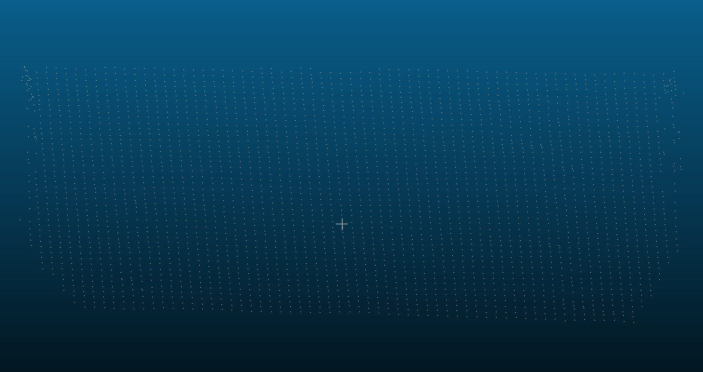
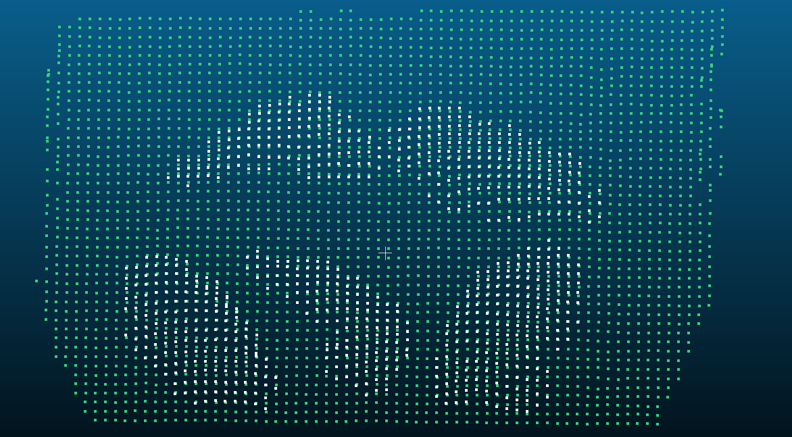

Measure a frame
===============

Inputs and coordinate frame
---------------------------

Capture at least one empty-tray frame and one food frame with the same camera and tray pose.
All points in both inputs must use the unit set by ``input_unit`` (metres by default). ROI
bounds and other distance parameters are always in metres, even when the input points are in
millimetres. The empty frames should cover the part of the tray occupied by food; an absent
baseline cell is not replaced by a flat plane.

A minimal C++ call
------------------

.. code-block:: cpp

   #include "measurement.hpp"
   #include <iostream>

   int main() {
       const PointCloud empty = load_pcd("empty_tray.pcd");
       const PointCloud food = load_pcd("food.pcd");
       if (empty.points.empty() || food.points.empty()) {
           std::cerr << "Could not read the input PCD files\n";
           return 1;
       }

       FoodVolumeMeasurer measurer;
       const VolumeEstimate result =
           measurer.set_baseline({empty}).set_food(food).run();
       if (result.status != MeasurementStatus::kSuccess) {
           std::cerr << status_to_string(result.status) << '\n';
           return 1;
       }
       std::cout << result.volume_cm3 << " cm3\n";
   }

For millimetre input, call ``set_input_unit(LengthUnit::kMillimeter)`` before ``run()``.
``load_pcd()`` returns an empty cloud when it cannot read a file. Check the return status
before reading numeric fields; they are NaN on failure.

How the volume is computed
--------------------------

The empty frames form a baseline height map on a fitted plane. Food points are filtered by
their height above that map, grouped by their footprint on the plane, and rasterised into
top-surface cells. For a cell with both a baseline height and a food height, the contribution
is the positive height difference times the cell area:

   Empty-tray observations used to form the baseline grid.

.. math::

   V = \sum_{c \in C} \bigl(h_{\mathrm{food}}(c)-h_{\mathrm{tray}}(c)\bigr)\,s^2

Here ``s`` is ``integration_resolution_m`` and ``C`` contains accepted measured and filled
cells. The implementation converts cubic metres to cubic centimetres for ``volume_cm3``.
It may fill an enclosed hole only when the rim belongs to one food component and the safety
checks pass. ``raw_volume_cm3`` and ``interpolated_volume_cm3`` separate observed from inferred
volume; an unfilled hole contributes neither.

   Food surface points compared with the tray grid before integration.

Reading the result
------------------

``component_count`` and ``component_estimates`` describe the selected food components.
``selected_cluster_labels`` is aligned with ``component_estimates``. ``measured_cells`` and
``interpolated_cells`` count observed and filled top-surface cells; ``unfilled_hole_cells``
counts gaps left unresolved. ``missing_baseline_cells`` counts food cells without a usable
empty-tray reference. ``coverage_ratio`` is the occupied fraction of the component bounding
grid, not a confidence score. AABB, OBB, and convex-hull volumes are geometric references in
cubic metres; they do not use the tray height integral.

Configuration without duplicate switches
----------------------------------------

Defaults are intended as a starting point. Change only the values your capture requires:

.. code-block:: cpp

   FoodVolumeMeasurer measurer;
   measurer.set_input_unit(LengthUnit::kMillimeter)
       .set_cluster_params(0.010, 8)       // footprint radius in metres, minimum points
       .set_middle_cloud_dir("middle_data"); // optional PCD output

An ROI object enables cropping; ``clear_roi()`` disables it. An empty ``selected_labels``
selects all eligible components; ``set_selected_labels({0})`` selects label 0. A nonempty
``middle_cloud_dir`` enables intermediate PCD output and an empty path disables it. The
secondary background plane, when enabled in ``MeasurementConfig``, uses the same
``plane_distance_threshold_m`` as the primary plane.

A JSON file may contain just the fields to override, for example:

.. code-block:: json

   {
     "input_unit": "millimeter",
     "voxel_size_m": 0.003,
     "middle_cloud_dir": "middle_data"
   }

Call ``load_config_from_json(path)`` before ``run()`` and check its Boolean return value.
Removed or unknown keys are rejected. Save a full snapshot with ``save_config_to_json(path)``.

Inspecting a measurement
------------------------

With ``middle_cloud_dir`` set, a successful run writes stage PCD files. Compare
``5_top_surface.pcd`` (measured top cells) with ``6_hole_filled_surface.pcd`` (measured plus
accepted filled cells). ``4_food_component_label<NN>.pcd`` isolates each selected component.
These files use world coordinates. If ``missing_baseline_cells`` is high, capture more of the
empty tray. If ``interpolated_cells`` is high, inspect the missing region before trusting the
filled volume.

For several food frames against the same empty tray, set the first food frame and call
``prepare_baseline()`` once. After a successful preparation, ``set_food()`` followed by
``run()`` reuses the baseline. Keep the camera, tray, input unit, and baseline-related
parameters fixed; changing baseline inputs or their parameters invalidates the cache. The
first food frame is also used to orient the plane normal, so later frames must be on the same
side of the tray.

When a run fails
----------------

Read ``status_to_string(result.status)`` first, then check the corresponding input:

.. list-table::
   :header-rows: 1
   :widths: 35 65

   * - Status
     - What to check
   * - ``kEmptyBaseline`` or ``kEmptyInput``
     - Confirm that the PCD files loaded and that ``set_baseline`` and ``set_food`` received
       nonempty clouds.
   * - ``kInvalidConfig``
     - Check positive distance and grid sizes, and strictly increasing ROI bounds.
   * - ``kPlaneNotFound`` or ``kBaselineNoCells``
     - Check whether the empty-tray capture has enough finite points over the measurement area.
   * - ``kFoodNotFound``
     - Check the crop, height range, clustering settings, and any selected labels.
   * - ``kUnsupportedPlatform``
     - Run the PCL measurement on a supported host platform.
