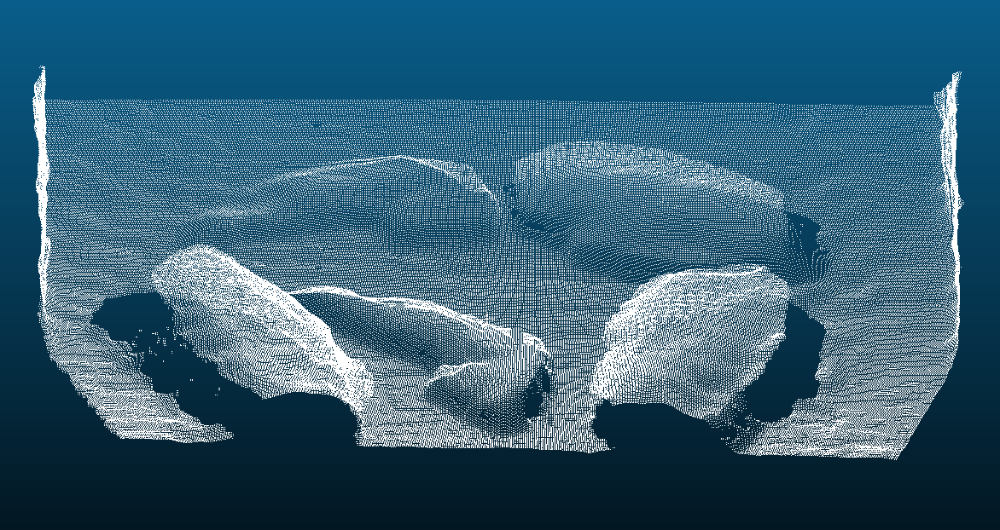
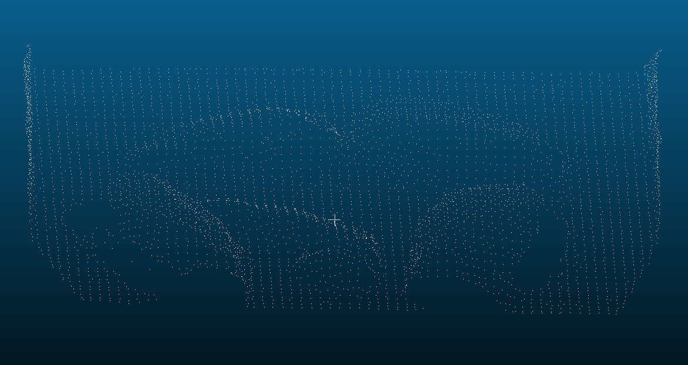
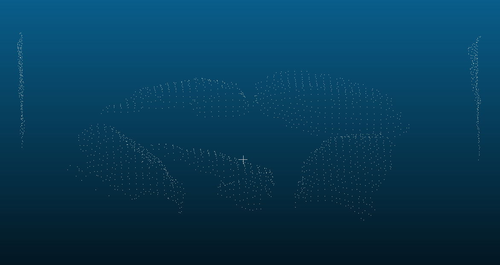
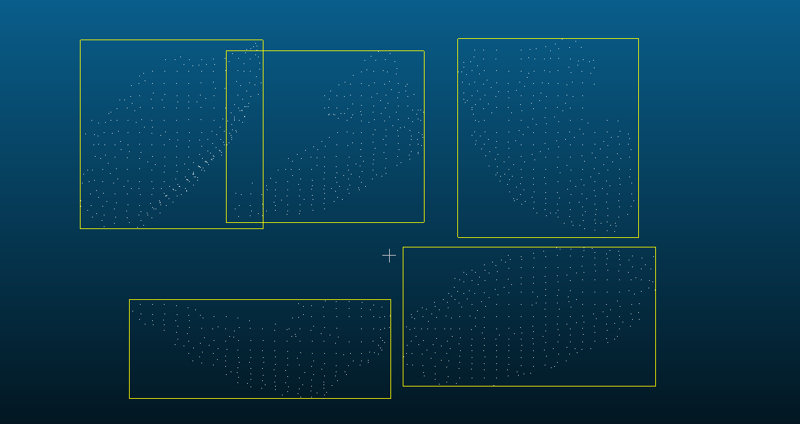

_`food_volume_measure Documentation`
=====================================

_`Introduction`
---------------

food_volume_measure is a C++17 library for point-cloud food volume measurement on
oven trays. It implements the IM (baseline-plane height-difference integral)
method: an empty-oven baseline is discretized into a local-plane height map, the
food cloud is voxel-downsampled and clustered in the baseline plane, and per-cell
height differences are integrated into a volume in cubic centimeters.

_`Algorithm Steps`
------------------

Measurement runs through six stages. The figures below show the rendered output of each stage for a real oven-tray scan.

   **Step 1 - Raw input cloud.** The food frame as captured by the tray-mounted depth camera; non-finite returns are dropped and coordinates are converted to metres.

   **Step 2 - Voxel downsampling.** Every occupied voxel keeps the centroid of its points, which suppresses sensor noise and removes the dependency on the raw point density.

   **Step 3 - Empty-oven baseline.** A RANSAC plane fit plus per-cell median heights turn the empty tray into the reference surface against which food heights are measured.

   **Step 4 - Background-plane removal.** The dominant tray plane is removed from the food frame, so that chiefly food points remain.

   **Step 5 - Component segmentation.** The remaining points are projected onto the baseline plane and clustered with DBSCAN, which separates distinct food items into individual components.

   **Step 6 - Height integral.** One top-surface point per raster cell is kept and its baseline-relative height is integrated over the cell area; enclosed holes are completed conservatively.

_`Main Features`
----------------

- Empty-oven baseline model with RANSAC plane fitting
- Open3D-equivalent voxel downsampling and DBSCAN clustering
- Component-aware conservative hole completion
- Reference volumes (AABB / OBB / convex hull)
- PCD loading via ``load_pcd``
- Host-side point-cloud processing; bare-metal stubs report an unsupported status

_`Quick Start`
--------------

.. code-block:: cpp

   #include "measurement.hpp"

   int main() {
       PointCloud baseline = load_pcd("empty_oven.pcd");
       PointCloud food = load_pcd("food.pcd");
       VolumeEstimate est =
           FoodVolumeMeasurer().set_baseline({baseline}).set_food(food).run();
       return est.status == MeasurementStatus::kSuccess ? 0 : 1;
   }

_`Project Structure`
--------------------

::

   food_volume_measure/
   ├── include/         # Public headers (*.hpp)
   ├── src/             # Implementation (*.cpp)
   ├── test_package/    # Consumer demo and unit/stress tests
   ├── benchmark/       # Cross-platform benchmark scaffolding
   ├── CMakeLists.txt   # CMake build configuration
   ├── conanfile.py     # Conan package configuration
   ├── metadata.json    # Project metadata
   └── LICENSE          # License file

_`Detailed Settings`
--------------------

For detailed settings in project-level meta, conan recipe, or cmake file, see:

.. toctree::
   CMakeList <components/cmake>
   Conanfile <components/conan>
   Metadata <components/meta>
   User concern contents <export>
   :numbered:
   :maxdepth: 2

_`License`
----------

This project is licensed under the Apache-2.0 License. See the LICENSE file for details.
